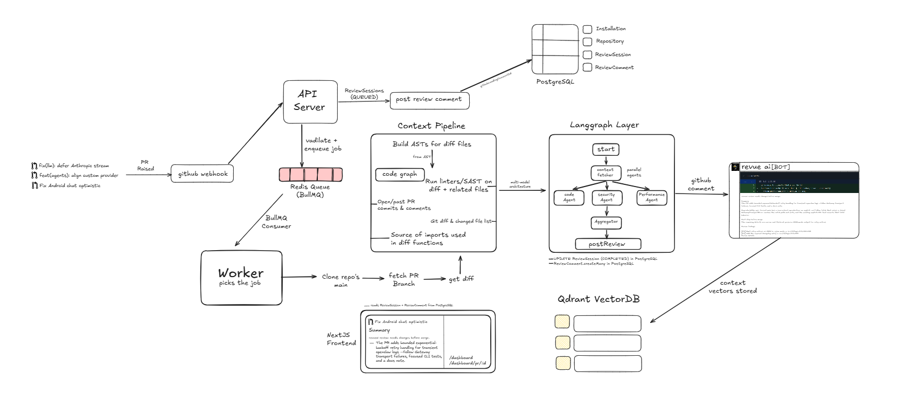

<p align="center">
  
</p>

<p align="center">
  <a href="https://github.com/apps/pullrabbit"></a>
  <a href="LICENSE"></a>
  <a href="https://bun.sh"></a>
  
</p>

<p align="center">
  <b>PullRabbit</b> is an AI-powered GitHub PR reviewer that understands your code - not just your diff.
</p>

<p align="center">
  <a href="#">Documentation</a> · <a href="#">Discord</a> · <a href="https://github.com/apps/pullrabbit">Install the GitHub App →</a>
</p>

---

**Install the GitHub App on your repo and PullRabbit reviews every PR automatically.**

```
github.com/apps/pullrabbit → Install → Select repos → Done
```

---

## Why PullRabbit

1. Most AI reviewers look at the diff. PullRabbit builds an AST, traces the call graph, runs linters, and fetches import sources, so it understands what the change actually does, not just what lines changed.

2. Three specialist agents run in parallel - code correctness, security, and performance — each with full context. You get focused findings, not a generic wall of text.

3. It fits inside GitHub's existing review workflow. No new dashboard to check, no context switching. Comments land inline on the PR the same way a human reviewer's would.

---

## How It Works

When a PR is opened, PullRabbit's GitHub App receives a webhook. The review job is queued immediately and a loading comment is posted on the PR so you see instant feedback. The worker then runs the full pipeline:

### Context fetching

PullRabbit clones the repo at the PR's head SHA and runs five context helpers in parallel:

- **AST analysis** - parses changed files into an abstract syntax tree, extracting functions, classes, and imports
- **Code graph** - walks the full repo (up to 400 files) to build a call graph: what the changed functions call, and what calls them — revealing blast radius
- **Linter / SAST** - runs static analysis on changed files to surface obvious errors before the LLM sees anything
- **PR history** - fetches past PRs that touched the same files, giving agents prior review context
- **Import resolution** - fetches source code of external functions called by changed code, so agents understand dependencies they didn't write

### Multi-agent review

After context is assembled, three LangGraph agents run in parallel - each receives the full context bundle:

| Agent | Focus |
|---|---|
| **Code Agent** | Correctness bugs, logic errors, missing edge cases |
| **Security Agent** | Injection, auth issues, secrets, unsafe patterns |
| **Performance Agent** | N+1 queries, unnecessary re-renders, blocking I/O |

Results are deduplicated, ranked by severity (CRITICAL → HIGH → MEDIUM → LOW), and capped at 12 comments. Blocking issues are flagged explicitly.

### Architecture



---

## How It Compares

|  | **PullRabbit** | CodeRabbit | Greptile | Graphite |
|---|---|---|---|---|
| AST-based analysis | ✅ | ❌ | ❌ | ❌ |
| Call graph traversal | ✅ | ❌ | ✅ | ❌ |
| Linter / SAST pre-pass | ✅ | Partial | ❌ | ❌ |
| Parallel specialist agents | ✅ | ❌ | ❌ | ❌ |
| Import source resolution | ✅ | ❌ | ❌ | ❌ |
| PR history context | ✅ | ✅ | ✅ | ❌ |
| Inline GitHub comments | ✅ | ✅ | ✅ | ✅ |
| Self-hostable | ✅ | ❌ | ❌ | ❌ |
| Open source | ✅ | ❌ | ❌ | ❌ |

CodeRabbit reviews the diff. Greptile understands the repo. PullRabbit does both — and runs specialist agents on top.

---

## What This Is Not

PullRabbit is not a replacement for human review. It catches mechanical issues — bugs, security holes, performance regressions - so human reviewers can focus on design, intent, and product decisions. It also won't catch issues that require understanding product requirements or business logic that isn't in the codebase.

---

## Stack

| Layer | Tech |
|---|---|
| Monorepo | Turbo + Bun workspaces |
| API server | Express, Octokit, JWT auth |
| Job queue | BullMQ + Redis |
| AI pipeline | LangGraph (multi-agent) |
| LLMs | Groq / OpenRouter (Llama 3.3 70B) |
| Vector store | Qdrant |
| Database | PostgreSQL via Prisma |
| Frontend | Next.js 16, Tailwind, Radix UI |
| Auth | GitHub OAuth + GitHub App |

---

## Roadmap

- Qdrant vector memory - store and retrieve code context across reviews
- Streaming reviews - post per-agent findings as they complete, not after all agents finish
- Repo-level caching - `git fetch` instead of fresh clone per PR
- Configurable agent roster - enable/disable agents per repo
- Review rules - custom instructions per repo (e.g. "always check for SQL injection in `/api` routes")
- Webhook deduplication - idempotency key to prevent double-processing on GitHub retries
- Slack / Linear notifications
- PR summary generation

---

## FAQ

<details>
<summary><b>Does it review every PR automatically?</b></summary>

<br/>

Yes. Once the GitHub App is installed and a repository is added, every new PR triggers a review automatically. No manual step needed.

</details>

<details>
<summary><b>How long does a review take?</b></summary>

<br/>

Typically 30–60 seconds end-to-end. A loading comment appears on the PR immediately so you know it's working. The full review replaces that comment when complete.

</details>

<details>
<summary><b>What languages are supported?</b></summary>

<br/>

AST analysis and code graph currently support TypeScript, JavaScript (`.ts`, `.tsx`, `.js`, `.jsx`, `.mts`, `.cts`). The diff-based LLM review works for any language.

</details>

<details>
<summary><b>Can I self-host it?</b></summary>

<br/>

Yes. Clone the repo, run `docker compose up -d` for PostgreSQL and Redis, configure the environment variables, and run `bun run dev`. See the documentation for the full setup guide.

</details>

<details>
<summary><b>Is it ready for production?</b></summary>

<br/>

PullRabbit is in beta. Core review pipeline is functional. Some features (Qdrant memory, streaming) are still in progress. Use in production at your own discretion.

</details>

<br />

<p align="center">
  <a href="https://github.com/apps/pullrabbit">Install PullRabbit on GitHub →</a>
</p>
