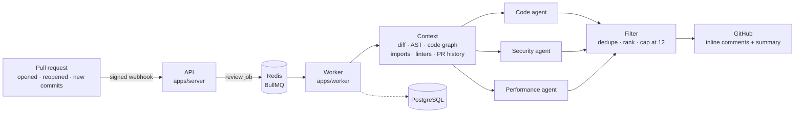

<p align="center">
  <a href="https://openmerge.site">
    
  </a>
</p>

<h1 align="center">OpenMerge</h1>

<p align="center">
  <strong>The open source pull request reviewer that reads more than the diff.</strong>
</p>

<p align="center">
  OpenMerge is a GitHub App that reviews every pull request with three specialist AI agents for code, security, and performance.
  It gathers context from the rest of your repository, then posts ranked findings on the exact lines that changed and one summary with a clear verdict.
</p>

<p align="center">
  <a href="https://openmerge.site"><strong>Website</strong></a> ·
  <a href="https://openmerge.site/docs"><strong>Docs</strong></a> ·
  <a href="https://github.com/apps/openmerge-app"><strong>Install the GitHub App</strong></a> ·
  <a href="https://github.com/shashank-poola/openmerge/issues/new/choose"><strong>Report a bug</strong></a>
</p>

<p align="center">
  <a href="https://github.com/shashank-poola/openmerge/actions/workflows/test.yml"></a>
  <a href="LICENSE"></a>
  
  <a href="CONTRIBUTING.md"></a>
  
</p>

<p align="center">
  
</p>

---

## Table of contents

- [Why OpenMerge](#why-openmerge)
- [Features](#features)
- [How it works](#how-it-works)
- [What it reviews](#what-it-reviews)
- [Getting started](#getting-started)
- [Self-hosting](#self-hosting)
- [Project structure](#project-structure)
- [Tech stack](#tech-stack)
- [Development](#development)
- [Project status and roadmap](#project-status-and-roadmap)
- [Contributing](#contributing)
- [Security](#security)
- [License](#license)

## Why OpenMerge

Most review tools see only the patch. A change can look fine in isolation and still break a caller three files away, reintroduce a bug that an earlier pull request fixed, or add a query that runs once per row.

OpenMerge starts with the diff and then looks outward: it parses the changed code, maps where the changed symbols are used, resolves imports, runs linters, and reads the history of past pull requests that touched the same files. Three focused agents review the change with that context. Their findings are deduplicated, ranked, and capped, so a review stays short enough to actually read.

OpenMerge is an additional reviewer, not an approval bot. It never approves, merges, or pushes code. Your team keeps the final decision.

## Features

- **Automatic reviews.** Every pull request is reviewed when it is opened, reopened, or receives new commits. There is nothing to add to your CI.
- **Repository context, not just the diff.** AST summaries, a code graph of callers, resolved imports, linter output, and related pull request history.
- **Three specialist agents in parallel.** Code, security, and performance agents each focus on one kind of risk.
- **Inline findings with severity.** Comments land on the changed lines, from Critical to Info, with replacement code when a concrete fix is clear.
- **Signal over noise.** Duplicate findings are dropped, blocking issues come first, and each review posts at most 12 comments.
- **A clear verdict.** One summary per review: changes requested, non-blocking suggestions, or looks good to merge.
- **Dashboard.** Review history, per-review findings, and a per-repository switch to pause automatic review.
- **Resilient by design.** Failed attempts retry with exponential backoff, and reviews from a stalled worker are recovered automatically.
- **Open source and self-hostable.** MIT-licensed. Run the web app, API, and worker on your own infrastructure.

## How it works


```mermaid
flowchart LR
    PR["Pull request<br/>opened · reopened · new commits"] -->|signed webhook| API["API<br/>apps/server"]
    API -->|review job| Q[("Redis<br/>BullMQ")]
    Q --> W["Worker<br/>apps/worker"]
    W --> CTX["Context<br/>diff · AST · code graph<br/>imports · linters · PR history"]
    CTX --> CODE["Code agent"]
    CTX --> SEC["Security agent"]
    CTX --> PERF["Performance agent"]
    CODE --> F["Filter<br/>dedupe · rank · cap at 12"]
    SEC --> F
    PERF --> F
    F --> GH["GitHub<br/>inline comments + summary"]
    W -.-> DB[("PostgreSQL")]
```

1. **Trigger.** GitHub sends a signed webhook. The API verifies `X-Hub-Signature-256`, records a review session for the pull request's head commit, queues a job, and posts a *Review in progress* note.
2. **Context.** The worker fetches the diff, clones the repository, and gathers five context sources in parallel. If one fails, the review continues without it.
3. **Agents.** The code, security, and performance agents review the same diff and context at the same time.
4. **Filter.** Duplicates are dropped, findings are ranked by severity with blocking issues (High and Critical) first, and the list is capped at 12.
5. **Post.** Findings are posted inline, and the progress note is replaced by the summary and verdict.

The full walkthrough is in [How a review works](https://openmerge.site/docs/how-it-works).

## What it reviews

| Agent | Looks for |
| --- | --- |
| **Code** | Logic bugs, edge cases that fail in common use, missing tests, and changes that are hard to maintain. |
| **Security** | Injection (SQL, NoSQL, command, template), missing authentication, access control gaps such as IDOR, leaked secrets or personal data, SSRF, path traversal, XSS, weak cryptography, and suspicious new dependencies. It flags only issues the pull request introduced or made worse. |
| **Performance** | N+1 queries, missing indexes, blocking work in async paths, unbounded fetches, memory leaks, sequential awaits that could run in parallel, and oversized payloads. |

Severity levels and categories are described in [Agents and severity](https://openmerge.site/docs/agents).

## Getting started

The fastest way to use OpenMerge is the hosted GitHub App.

1. Go to [openmerge.site](https://openmerge.site) and click **Get started** to sign in with GitHub.
2. Install the [OpenMerge GitHub App](https://github.com/apps/openmerge-app) and choose the repositories it can review.
3. Open a pull request, or push a commit to an open one. The review appears on the pull request.

See the [Quick start](https://openmerge.site/docs/quick-start) for details, and [Troubleshooting](https://openmerge.site/docs/troubleshooting) if a review does not show up.

## Self-hosting

### Prerequisites

- [Bun](https://bun.sh) 1.2.22 or later, and Node.js 20 or later
- [Docker](https://www.docker.com/) for local PostgreSQL and Redis
- A GitHub App and a GitHub OAuth app that you control
- A [Groq](https://groq.com) API key. A Gemini API key is optional: when set, Gemini runs first and Groq is the fallback.

### Run it locally

```bash
git clone https://github.com/shashank-poola/openmerge.git
cd openmerge
bun install

# PostgreSQL on localhost:5433 and Redis on localhost:6379
docker compose up -d

# Fill in the GitHub, database, and model credentials
cp apps/server/.env.example apps/server/.env
cp apps/web/.env.example apps/web/.env

# Create the database schema
cd packages/database && bun run db:migrate:dev && cd ../..

# Start the web app (:3000), API (:8000), and worker in watch mode
bun run dev
```

The API validates its environment at startup and exits with a clear message if a required variable is missing.

### Observability (optional)

Set `LANGFUSE_PUBLIC_KEY` and `LANGFUSE_SECRET_KEY` (plus `LANGFUSE_BASE_URL` and, if you like, `LANGFUSE_TRACING_ENVIRONMENT`) to send model traces, token usage, and latency for every review to [Langfuse](https://langfuse.com). Tracing stays off when the keys are absent, and a tracing failure never fails a review.

> [!WARNING]
> Traces contain the prompts sent to the model, which include the reviewed diff and surrounding source. Point `LANGFUSE_BASE_URL` at a self-hosted Langfuse instance when reviewed code must not leave your infrastructure, or leave the keys unset to disable tracing.

### Configure your GitHub App

| Setting | Value |
| --- | --- |
| Webhook URL | `https://<api-host>/api/v1/webhook/github` |
| Webhook events | Pull request, Installation |
| Setup URL | `https://<web-host>/setup` |
| OAuth callback URL | `https://<web-host>/auth/github/callback` |
| Permissions | Read repository contents and pull requests; write pull request comments |

The API only accepts browser requests from the origins listed in `apps/server/src/index.ts`, so add your web host there.

Every environment variable, plus a production checklist, is documented in [Self-hosting](https://openmerge.site/docs/self-hosting).

## Project structure

```text
openmerge/
├── apps/
│   ├── web/                 Next.js app: landing page, docs, sign-in, and dashboard
│   ├── server/              Express API: OAuth, webhooks, and REST routes
│   │   └── src/graph/       The review pipeline: context, agents, aggregation, posting
│   └── worker/              BullMQ consumer that runs the review pipeline
├── packages/
│   ├── database/            Prisma schema, migrations, and client
│   ├── redis/               Shared Redis client
│   ├── ui/                  Shared React components
│   ├── config-eslint/       Shared ESLint config
│   └── config-typescript/   Shared TypeScript config
├── tests/                   Unit and integration tests
└── docker-compose.yml       Local PostgreSQL and Redis
```

## Tech stack

| Layer | Technology |
| --- | --- |
| Web | [Next.js](https://nextjs.org) 16, React 19, Tailwind CSS 4 |
| API | [Express](https://expressjs.com) 5, Zod, Octokit |
| Review pipeline | [LangGraph](https://langchain-ai.github.io/langgraphjs/), Gemini (optional) with Groq fallback |
| Queue | [BullMQ](https://bullmq.io) on Redis |
| Database | PostgreSQL with [Prisma](https://www.prisma.io) 7 |
| Observability | [Langfuse](https://langfuse.com) via OpenTelemetry (optional) |
| Tooling | [Bun](https://bun.sh), [Turborepo](https://turbo.build), TypeScript |

## Development

Run commands from the repository root:

```bash
bun run dev          # Start every app in watch mode
bun run lint         # Lint all workspaces
bun run typecheck    # Type-check all workspaces
bun run test         # Unit and integration tests
bun run build        # Production build
```

To work on a single app, filter by workspace, for example `bun run dev --filter=web`. For database changes, run `bun run validate` and `bun run generate` in `packages/database`.

Continuous integration runs the same checks on every pull request: a frozen-lockfile install, Prisma validation, migrations against a clean database, lint, typecheck, tests, and build.

## Project status and roadmap

OpenMerge is in **beta**. The core review flow is working. Treat every finding as a suggestion and check it before acting on it, especially on security-sensitive code.

Planned work:

- [ ] Configurable review rules per repository
- [ ] Richer repository memory across reviews
- [ ] Streaming findings while a review runs
- [ ] Additional notification channels

Ideas and feedback are welcome in [issues](https://github.com/shashank-poola/openmerge/issues).

## Contributing

Contributions are welcome. Read the [contributing guide](CONTRIBUTING.md) for the branch workflow, naming conventions, and the checks to run before opening a pull request. In short:

1. Branch from `main`, for example `fix/<short-name>`.
2. Keep the change focused, and add or update tests when behavior changes.
3. Run `bun run lint`, `bun run typecheck`, `bun run test`, and `bun run build`.
4. Open a pull request into `main` and wait for CI.

## Security

Please do not report security vulnerabilities in public issues. Follow the process in [SECURITY.md](SECURITY.md) instead.

## License

OpenMerge is released under the [MIT License](LICENSE). Copyright © 2026 shashank.
